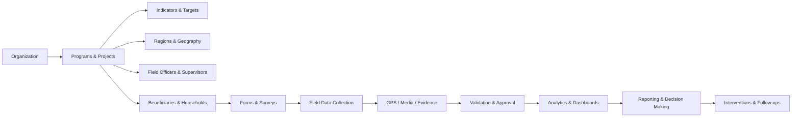

# Operational Ecosystem Integration

The platform now treats field data collection as one connected operational workflow, not as disconnected CRUD modules.

## Core Chain

## Backend Integration Layer

New tables:

- `operational_events`
- `operational_links`
- `workflow_queue_items`

These tables capture:

- what happened
- which module triggered it
- which project, beneficiary, or submission it belongs to
- which connected systems need refresh or review
- which supervisor workflow queue item was created

## Event Fan-Out

Examples:

- `beneficiary.enrolled` updates dashboards, analytics, reporting, geospatial layers, and offline field profiles.
- `case.opened` routes a supervisor task, notifies the owner, and keeps the beneficiary profile connected.
- `data_import.created` triggers validation, conflict review, dashboard refresh, and reporting cache invalidation.
- `bulk_edit.created` creates audit rollback metadata and queues offline delta sync.

## API

- `GET /api/v1/operations/ecosystem`
- `POST /api/v1/operations/events`

The ecosystem endpoint returns the operational graph, recent events, open workflow queue items, and attention items.

## Product Behavior

The new **Ecosystem** workspace makes the connected workflow visible to users. It explains how projects, beneficiaries, forms, submissions, approvals, analytics, reports, and interventions feed one another.

This helps admins and supervisors understand operational context before taking action.
